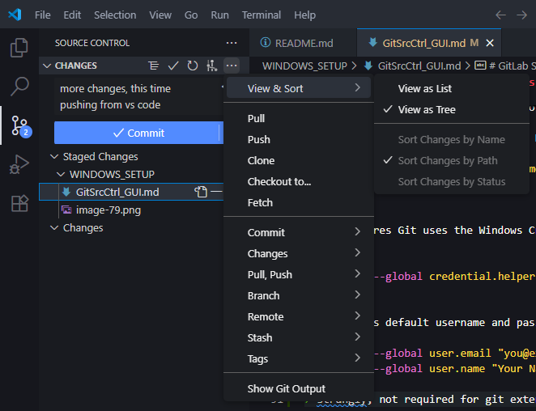
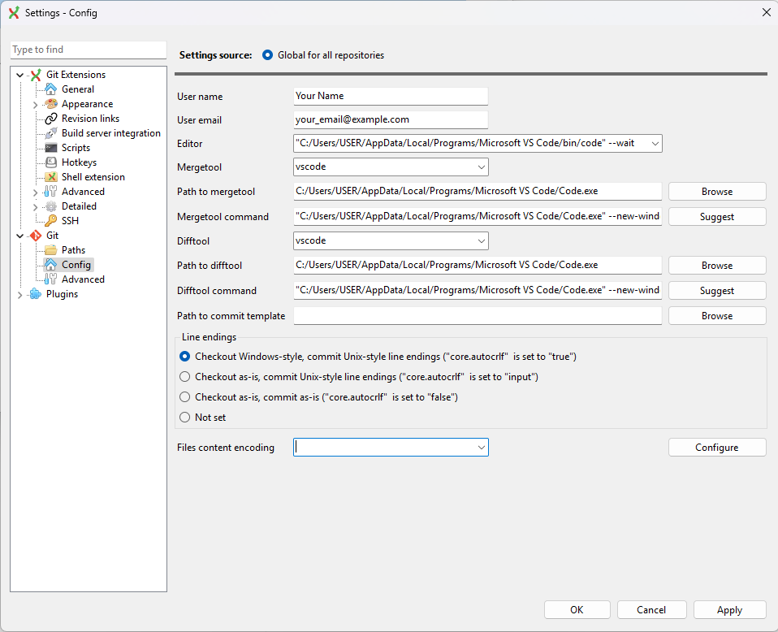
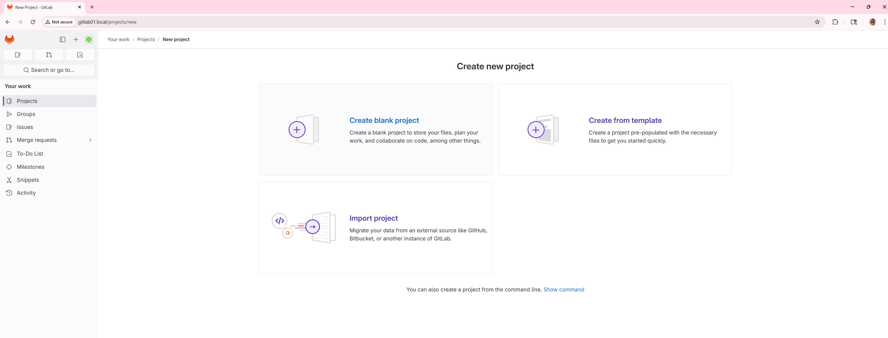
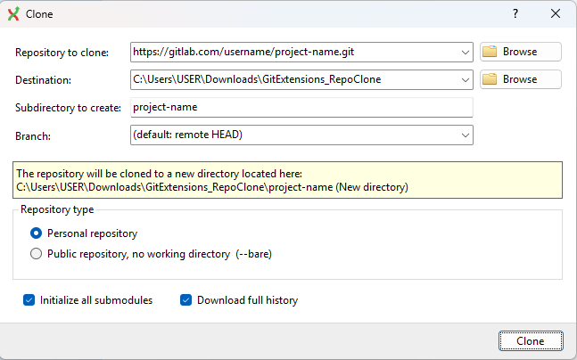
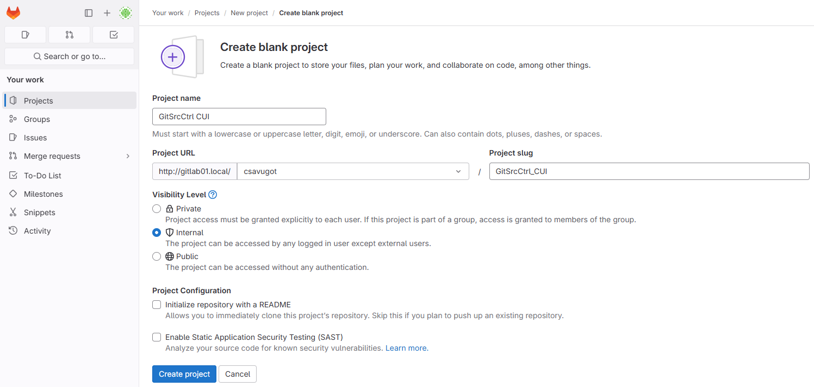

# GitLab Setup & Workflow for Windows <br> (Using Git Extensions & HTTPS)

## 📚 Table of Contents
* [Applications Overview](#-applications-overview)
* [Installing Git for Windows](#-installing-git-for-windows)
* [Installing Git Extensions](#-installing-git-extensions)
* [Installing and Configuring VS Code](#-installing-and-configuring-vs-code)
* [Initial Git Configuration](#-initial-git-configuration)
* [GitLab HTTPS Authentication Setup](#-gitlab-https-authentication-setup)
* [Cloning a GitLab Repo](#-cloning-a-gitlab-repo)
* [Using Git Extensions (Common Tasks)](#-using-git-extensions-common-tasks)
* [Handling Merge Conflicts](#-handling-merge-conflicts)
* [Fix-Specific Troubleshooting](#-fix-specific-troubleshooting)
* [Advanced Git Knowledge](#-advanced-git-knowledge)
* [Resources & References](#-resources--references)

---

##  Applications Overview

| Application            | Purpose                                    |
| ---------------------- | ------------------------------------------ |
| Git for Windows        | Backend Git system                         |
| Git Extensions         | Graphical Git UI                           |
| VS Code                | Code editing + Git integration             |
| Git Credential Manager | Secure token handling (installed with Git) |
| Optional Tools         | Meld/KDiff3 for diff/merge support         |

---

##  Installing Git for Windows
### Download Installation File
1. Go to [git-scm.com](https://git-scm.com/downloads/win) and download the latest Windows installer.
2. Double-click the downloaded `.exe` file to launch the setup wizard.
### Install using the Setup Wizard
3. Follow Installation Steps (Recommended Defaults):

4. Click `Yes` if a **User Account Control** prompt appears. 
    * Note: This action may require administrator access. If you are not the administrator of your machine, you will have to get administrator approval. Typically, this means an admin will have to enter their credentials into a prompt that appears. <br> 

5. Click `Next`. <br> 

6. Accept default install path or specify a location. Click `Next` to proceed.
    * If you do not use the default path, other applications may struggle to locate Git Extensions. Record the custom path to configure companion applications in the future. <br> 

7. Select the following Components. Click `Next` when done. <br> 

8. Click `Next` to continue. <br> 

9. Choose Visual Studio Code as your preferred editor. <br> 

10. Select `Override the default branch name for new repositories` and ensure the specified name is `main`. Click `Next` to continue. <br> 

11. Select `Git from the command line and also from 3rd-party software` the click `Next`. <br>  

12. Select `Use bundled OpenSSH` and click `Next`. <br> 

13. Select `Use the native Windows Secure Channel library` and click `Next`. <br> 

14. Select `Checkout Windows-style, commit Unix-style line endings`. This helps ensure compatibility across both Windows and Unix Based Systems. Click `Next` to continue. <br> 

15. Select `Use MinTTY (the default terminal of MSYS2)`. Click `Next` to continue. <br> 

16. Select `Fast-forward or merge`. Click `Next` to continue. <br> 

17. Select `Git Credential Manager`. Click `Next` to continue. <br> 

18. Ensure both `Enable file system caching` and `Enable symbolic links` is **selected**. Click `Next` to continue. <br> 

19. When installation is complete, ensure `Launch Git Bash` is **selected** and `View Release Notes` is **deselected**. Next, click `Finish`. <br> 

## Configure Git
20. Enter the following commands into Git BASH

* Automatically Set Upstream for New Branches
```bash
git config --global push.autoSetupRemote true # Auto-sets upstream when pushing new branches
```

* This ensures Git uses the Windows Credential Manager to save your GitLab login info.
```bash
git config --global credential.helper manager-core
```

* Configures default username and password for all git repos
```bash
git config --global user.email "you@example.com"
git config --global user.name "Your Name"
```
> strangely, not required for git extensions, only vscode src ctrl

22. Close Git Bash, you won’t need it again.

> TODO:

add info for pressing buttons in vscode

---

##  Installing Git Extensions
### Download Installation File
1. Go to [gitextensions.github.io](https://gitextensions.github.io/) to download Git Extensions.

2. Click the blue `Download` button. <br> 

3. On the GitHub Releases page, download only the `GitExtensions-x64-<Version>.msi` file. <br> 

### Install using the Setup Wizard
4. Click `Next`. <br> 

5. Select `Install for all users`. Click `Next`. <br> 

6. Accept default install path or specify a location. Click `Next` to proceed.
    * If you do not use the default path, other applications may struggle to locate Git Extensions. Record the custom path to configure companion applications in the future.  <br> 

7. Click `Next`. <br> 

8. Deselect telemetry if preferred. <br> 

9. Click `Install`. <br> 

10. Click `Yes` if a **User Account Control** prompt appears. 
    * Note: This action may require administrator access. If you are not the administrator of your machine, you will have to get administrator approval. Typically, this means an admin will have to enter their credentials into a prompt that appears. <br> 

11. When installation is complete click `Finish`. <br> 

---

##  Installing and Configuring VS Code
1. Download from [https://code.visualstudio.com](https://code.visualstudio.com)
2. Click VSCodeUserSetup application to open and start download <br>
3. Once open, click `I accept the agreement` then `Next` <br>
4. Select a destination location then `Next` <br>
5. Click `Next` to continue setup <br>
6. Make sure all boxes are checked, then click `Next` <br>
7. Make sure everything is correct then click `Install` <br>
8. To finish installation click `Finish`<br>
9. Once VS Code opens, click the `x` (boxed in yellow), you do not need anything on this screen <br>
10. Click `File` in the top left corner, then `Open Folder` <br>
11. Navigate to the folder that you want to open in File Explorer
12. On the `Trust Authors` page click the check box then`Yes, I trust the authors` (both boxed in yellow) <br>


---

## File Explorer Configuration
Show how to always display hidden files in File Explorer
* Open File Explorer:
* Click `View` > `Show` > `Hidden items`
<br> 

##  Setting Up Git + Git Extensions with GitLab (HTTPS Authentication)

###  Prerequisites

* Git for Windows is installed
* Git Extensions is installed
* You have a GitLab account and repo access
* You will use HTTPS for authentication

---

##  Initialize Git Extensions
1. Launch Git Extensions. When launching for the first time, you will be asked to select an language. Select English by clicking on the UK Flag<br> 

2. A dialog box asking for permission to collect telemetry data will appear. Click `No` to disable telemetry. <br>  

3. Within Git Extensions → `Tools > Settings > Git > Config` <br> 

4. Set your identity:
<!-- * User Name: `Your Name`
* Email: `your_email@example.com`
* USER: `Computer Username`
 -->

<!-- AEGIS Credentials -->
* User Name: `csavugot`
* Email: `csavugot@aegispower.com`
* USER: `csavugot`
> 

5. Click **Apply**

>  This ensures your commits are linked to your GitLab identity.


---

##  Create a Personal Access Token (PAT) on GitLab

1. Go to Aegis' GitLab and sign in.
<!-- [GitLab.com](https://gitlab.com/) -->
[AEGIS Gitlab Link](http://gitlab01.local/)
   → Click your **User icon > Preferences > Access Tokens**

2. Fill out:

   * **Name**: `GitExtensions` or something memorable
   * **Scopes**: `read_repository`, `write_repository`
   * (**Optional**) Set an expiration date
    > Setting an expiration date means this token will no longer work after that date. After this date, you will have to create a new token and reconfigure software that depended on this token for managing remote repos. Only set an expiration date if you have a very good reason to.
3. Click **Create personal access token**
<br> 

4. Copy the token now, you won’t see it again.

> TODO: link to section where PAT is needed
---

## Create Repository in GitLab





---

## Rename Repository in GitLab
Changing the repository name and URL in GitLab involves a few steps: updating the repository name in the GitLab web interface, and then updating your local Git repository’s remote URL to match. Here’s a step-by-step guide:

###  Step 1: Change the Repository Name in GitLab

1. **Log in to GitLab** and go to the **project page** of the repository you want to rename.

2. In the left sidebar, click **Settings** > **General**.
<br> 

3. Expand the **Naming, topics, avatar** section and update the **Project name**
<br> 

4. Click the blue `Save changes` button

5. Expand the **Advanced** section.

6. Update the **Path** directory within the **Change path** section to match new name
<br> **Project name:** `GitSrcCtrl GUI`
<br> **Path:** `GitSrcCtrl_GUI`
> Note: If any space characters were used within Project name, replace with `_` here.

7. Click the red `Change path` button to confirm changes.
<br> 

---

###  Step 2 (GUI): Update the Remote URL in Git Extensions

After renaming your repository in GitLab, follow these steps to update the remote URL using **Git Extensions**:

1. **Open Git Extensions** and navigate to your local repository by selecting **Repository > Open**.

2. In the top menu, click **Repository > Remote repositories**.

3. A window titled **Remote repositories** will appear, listing the current remotes. Select the correct remote repository (In most cases, there will only be one.)

4. Update the **Name** and **Url** details to match the **Project name** and  <br> 

6. Click **Save** (or **OK**) to apply the changes.
<br> 

7. (Optional) Verify the change:
   * Go to **Repository > Remote repositories** again.
   * Confirm that the URL listed matches your new GitLab repository URL.


---

##  Clone a GitLab Repository in Git Extensions

1. Open **Git Extensions**
2. In the **left-hand sidebar**, click **Clone repository**
3. In the Clone dialog:
   - **Repository to clone**: paste your GitLab HTTPS URL  
     _(e.g., `http://gitlab01.local/username/project-name`)_ <!-- AEGIS -->
     <!-- _(e.g., `https://gitlab.com/username/project-name.git`)_ -->
     > Note, although typically you can copy the `Clone with HTTP` URL found by clicking the blue `Code` button in a remote gitlab repository, this URL does NOT work at AEGIS. We're really not sure why...
   - **Destination**: choose where to save the local copy
4. Click **Clone**

 <!-- AEGIS -->
<!--  -->

5. (Initial Setup Only) The first time you perform Git actions like **clone**, **pull**, or **push**, Git Credential Manager will prompt you for credentials:
<br> 
> - **Username**: your GitLab **username or email**
> - **Password**: your **Personal Access Token (PAT)**  
>  Git will save these securely via Windows Credential Manager.

6. Click 'OK' after the Clone process is complete.
<br> 

7. Dialog box says 'cloned successfully, would you like to open repository?' Click `yes`.
> TODO Capture Screenshot of Dialog Box
---

##  Using Git Extensions (Common Tasks)

###  Committing Changes

1. Make changes in your working directory
2. Open Git Extensions and select the repository
3. Click `Commit` in the toolbar
4. Stage files, add message, and click `Commit`

🖼️ *Screenshot Placeholder: Git Extensions commit window*

###  Pulling from Remote

1. Click `Pull` in the toolbar
2. Confirm remote and branch (usually `origin` and `main`)
3. Click **Pull**

🖼️ *Screenshot Placeholder: Pull dialog*

###  Pushing to Remote

1. After commit, click `Push`
2. Confirm remote and branch, then click **Push**

🖼️ *Screenshot Placeholder: Push dialog*

<!-- ###  Merging with `--no-ff`

> Your team always uses `--no-ff` to preserve history

1. Click `Merge` or go to `Commands > Merge branches`
2. Select source branch (e.g., `feature`)
3. Uncheck **Fast-forward merge** to enforce `--no-ff`
4. Click **Merge**

🖼️ *Screenshot Placeholder: Merge window with no-ff selected* -->


---

## Fix-Specific Troubleshooting

| Problem                         | Fix                                                       |
| ------------------------------- | --------------------------------------------------------- |
| `Authentication Failed`         | Use GitLab username + token. Clear credentials if needed. |
| `Repository Not Found`          | Double-check URL and repo permissions.                    |
| `SSL Certificate Error`         | Sync system clock or reinstall Git with updated certs.    |
| `Git Not Recognized in VS Code` | Ensure Git is in your PATH. Reinstall Git if needed.      |

---

##  Advanced Git Knowledge

### Understanding Loose Git Objects and `git gc`

<details>
<summary>Click to expand</summary>

#### What are Loose Objects?

* Git stores commits and data as objects
* Objects can be stored as loose (individual) or packed (batched)

#### Why This Matters

Too many loose objects can degrade performance

#### What `git gc` Does

* Compresses loose objects
* Deletes unreachable refs
* Frees up disk space

#### Run the Cleanup

```bash
git gc
```

</details>

### Error: "Revision is not visible in the revision grid"

<details>
<summary>Clear all Filters, click to expand</summary>

This error means the commit exists, but Git Extensions is hiding it due to filters.

**Solution:**
<br> 
1. Clear the `Filter:` box (top right of the Git Extensions window)
2. Set `Branches:` dropdown to `All branches`
3. Click the funnel icon (🔽) on the far left → select **"Show all revisions"**
4. If needed, go to `Repository > Rescan` or restart Git Extensions

The commit should now appear in the revision graph.

</details>

---

## Resources & References

* [GitLab Docs](https://docs.gitlab.com)
* [Git Extensions Wiki](https://github.com/gitextensions/gitextensions/wiki)
* [VS Code GitLab Extension](https://marketplace.visualstudio.com/items?itemName=GitLab.gitlab-workflow)
* [Git Credential Manager](https://github.com/git-ecosystem/git-credential-manager)

---


# 📚User Guides & Tutorials

## Guided Git GUI Workflow (VS Code & Git Extensions)

This section supplements the original Git Flow guide with **graphical (GUI) alternatives** using **VS Code** and **Git Extensions**, minimizing command-line usage.

---

## Branch Structure Summary

Following Git Flow:
* `main` → Stable, production-ready code (only updated from `release/*` or `hotfix/*`)
* `develop` → Integration branch for all features
* `feature/*` → Short-lived branches for individual features (e.g., `feature/login-ui`)
* `release/*` → Pre-release stabilization branches (e.g., `release/<version>`)
* `hotfix/*` → Emergency fixes branched from `main` (e.g., `hotfix/<version>`)

Tags like `v1.0.0`, `v1.1.0`, and `v<version>` mark official release points.

>  **Note:** Each feature should be developed in a **separate branch** from `develop`. Feature branches follow the naming convention `feature/*`, where `*` is a brief, dash-separated description (e.g., `feature/export-csv`).


---


### Create Remote Repository on GitLab

1. Log in to <!-- [GitLab.com](https://gitlab.com/) --> [AEGIS Gitlab Link](http://gitlab01.local/).

2. Click **New Project** → **Create Blank Project**.

3. Name your project. Ensure settings and preferences are correct.
* Sample with Suggested Configuration
<br> 
> Deselected `Initialize repository with a README` because I already have README stored in my local directory that I wish to push to this remote repository. 

4. Click **Create Project**.

5. Copy the HTTPS URL 
<!-- * `https://gitlab.com/username/project-name` -->
* `http://gitlab01.local/username/project-name`
* `http://gitlab01.local/csavugot/GitSrcCtrl_CUI`
<!-- AEGIS -->
> This will be used later to clone the remote repo
---


### Create Local Repository from Existing Code & Push to Remote (First-Time Upload)

> Note this is only for local directories that haven't been initialized as local repositories. This means the do not contain the .git folder. 
> .git may be hidden depending on file explorer settings. See [File Explorer Configuration](#file-explorer-configuration) for more info.

**Using Git Extensions:**
1. In the **left-hand sidebar**, click `Create new repository`
<br> 

2. Click `Browse` to locate and select local directory you wish to initialize as a local repository. Ensure Repository type is set to `Personal repository` and click `Create`
<br> 

3. You should see a message similar to the following if Git Extensions was able to successfully initialize a new repository in the specified location. Click `OK` to continue.
<br> 

4. In the **left-hand sidebar**, right-click `Remotes`, then click `manage`

5. Fill out the **Create New Remote** section. Use the URL you copied from GitLab earlier.
* **Name:** GitSrcCtrl_CUI
* **Url:** http://gitlab01.local/csavugot/GitSrcCtrl_CUI
<br> 
> Note: The name MUST be the one specified in the URL, which cannot include spaces. This may be different than the name you see on the GitLab website UI

6. If you receive the following message, Git was able to locate your Remote Repository. Click `Yes` followed by `OK` to continue.<br> 

7. Close the **Remote repositories** pop-up box by pressing the `x` in the top right corner.

8. Press the purple `Commit` button found on the ribbon.
<br> 

9. Stage all changed by pressing the purple multi-down-arrow icon highlighted below.
<br> 

10. After adding a Commit message to the respective dialog box, click `Commit` followed by `OK`.

11. Push to Remote. For Details, see [Push to Remote](#push-to-remote)
<!-- 11. Click `Commands` > `Push...`. After ensuring that all information is correct, press the `Push` button.
* Ensure the both the branch selected to push from and to is `main`
<br> 

12. Click `Yes` followed by `Yes` followed by `OK`.
<br>  -->
---

### Clone Remote Repository to Local

**Using Git Extensions:**

1. Open Git Extensions → **Clone Repository**.
2. Paste the GitLab repo HTTPS URL.
3. Choose a local folder → Click **Clone**.

---
### Pull all Remote Branches to Local Repo
**Using Git Bash:**

1. Open **Git Bash**
- Either put instructions here, or link to instructions

2. Navigate to the local directory where the Remote Repo has been cloned. In my case:
```bash
cd /c/Users/csavugot/Downloads/APBDC-E01/apbdc-e01
```
> Within **Git Bash**, this is the general syntax to reach a User's Windows Downloads Directory <br>
> `cd /c/Users/<YourWindowsUsername>/Downloads`

3. Enter the following command
```bash
git fetch --all --prune
for remote in $(git branch -r | grep -v '/HEAD'); do
  local=${remote#origin/}
  git branch --track "$local" "$remote" 2>/dev/null
done
```

4. Refresh **Git Extensions** using `F5` to confirm it worked. You should soo all of the Remote Branches now exist locally
<br> 

---

### Open Local Repository
#### **Using Git Extensions**
1. On the **left-hand sidebar**, click `Open repository` to open a repository. 
<br> 

2. Click `Browse...` to select a file directory that has been initialized as a repository. Next, click `Open`
<br> 
> The file directory must include the .git folder, which is how you can confirm it is an initialized repo.

---

### Push to Remote
> TODO: Verify this claim: Good for Tags, new branches, code development
1. Click `Commands` > `Push...`. 
<br> 

2. After ensuring that all information is correct, press the `Push` button.
* Ensure the both the branch selected to push from and to is `<CURRENT_BRANCH>`
<br> 

3. If more prompts appear, click `Yes` followed by `Yes` followed by `OK`.
<br> 

---

### Create and Manage Branches - Git Extensions
> Assumes you have already have a repository open. For more details, see [Open Local Repository](#open-local-repository)

#### Create Branch based on Local Directory
> New branch is based on local Directory, not remote branch
1. On the Ribbon, Click `Commands` > `Create branch...`  <br> 
2. Enter branch name, ensure the following options are selected, and click `Create branch`
* Select `Checkout after create`
* Deselect `Create orphan`
<br> 

3. Click `OK`

4. Push to Remote. For Details, see [Push to Remote](#push-to-remote)

5. To make this prompt disappear, uncheck the `Keep dialog open` box
<br> 


#### Create Branch based on Remote Branch
> Pay Attention to the checked out branch, the branch listed in bold on the left-hand sidebar under branches. The new branch will pull from the Remote of the checked out branch.

> TODO: Write this section later. I don't care about this right now...

#### Checkout Branch
> **BEFORE** Checking out branch, commit all changes to current branch so that there are no conflicts. 
1. Double Click on the Branch you wish to Checkout from the Branches in the **left-hand sidebar**
2. If there are conflicts, the following pop-up will appear given you access to many different solutions.
<br> 

#### Merge Branch
1. Checkout the branch you wish to merge into (target branch). For more details, see [Checkout Branch](#checkout-branch)

2. Click `Commands` > `Merge Branches...`

3. Select the branch you wish to merge from (source branch).

4. Ensure all other selections match the screenshot below.
* Click `Always create a new merge commit`
* Select `Show advanced options`
* Select `Specify merge message`
* Enter a merge message


5. Click `Merge`

> TODO: Talk about the wonderful world of merge conflicts

#### Delete Branch
> After merging a feature branch with `--no-ff`, it's safe to delete the branch.  
> The full history, including all commits and the merge itself, is preserved in the develop branch.  
> Deleting the branch only removes the name; it does **not** erase any commit history.

> You cannot delete the branch thats currently checked-out. Checkout a different branch first. For more details, see [Checkout Branch](#checkout-branch)

1. Right Click on the Branch you wish to delete within the **left-hand sidebar**. Click `Delete Branch...`

2. Click `Delete` to confirm branch deletion 

> As mentioned, you can see from the Git Graph that although the branch was deleted, its history of existence is preserved. (Light Blue Line)
<br> 

### Delete Remote Repo
Note: The instructions below are for deleting a remote branch that has already been deleted locally. If you need to know how to delete a local branch, see [Delete Branch](#delete-branch)

1. Click `Commands` > `Push...`
<br> 

2. Select the `Push multiple branches` tab.
<br> 

3. Select all branches that don't exist locally.
    > Branches that don't exist locally will not have a check box under the **Push** or **Force** Column.
<br> 

4. Click `Push`
---

## Branch Workflows and Management (GUI-Based)

### `main` Branch

* **Purpose**: Production-ready, stable code only
* **GUI Tasks**:

  * Default on clone; use Git Graph to visualize
  * Merge `release/*` or `hotfix/*` into it via Git Extensions (always use `--no-ff`)
  * Tag releases after merge using right-click → **Create Tag**

---

### `develop` Branch

* **Purpose**: Integration of all features
* **GUI Tasks**:

  * Create from `main`: Branch → Create → base on `main`
  * Push after creation
  * Merge `feature/*` branches into it via Merge dialog (check `--no-ff`)
  * Merge `release/*` back into it post-launch

---

### `feature/*` Branches

* **Purpose**: New features or experiments
* **Create**: Branch → Create → base on `develop`
* **Maintain**:

  * Make changes, commit via Source Control (VS Code) or Git Extensions
  * Push often
* **Merge to `develop`**:

  * Use Git Extensions → Merge → Select `feature/*` → ensure `--no-ff`
  * Delete via right-click after merge (local & remote)

---

### `release/*` Branches

* **Purpose**: Final polish before release
* **Create**: Branch → Create → base on `develop`
* **Maintain**:

  * Bug fixes, final tweaks, versioning changes
  * Push to remote
* **Finish**:

  * Merge into `main` using Git Extensions (check `--no-ff`)
  * Tag via right-click → Create Tag → `vX.X.X`
  * Merge back into `develop` via Merge dialog
  * Delete both locally and remotely after merge

---

### `hotfix/*` Branches

* **Purpose**: Urgent patches for `main`
* **Create**: Branch → Create → base on `main`
* **Maintain**:

  * Apply critical fixes
  * Commit and push
* **Finish**:

  * Merge into `main` with `--no-ff`
  * Tag with version
  * Merge into `develop` to prevent regression
  * Delete branch after merge

---

### Commit, Pull, Push (From VS Code)

1. Open Source Control (Ctrl+Shift+G)
2. Stage using `+` button
3. Write message → Click ✔ to commit
4. Use ⋯ menu → **Push**, **Pull**, or **Sync**

---

### Merge Branches (With `--no-ff` Policy)

**In Git Extensions:**

1. Click **Merge** → Choose branch
2. Enable **Create merge commit even when fast-forward is possible**
3. Click **Merge**

---

### Handle Merge Conflicts in VS Code

1. Attempt merge → VS Code highlights conflicts
2. Open file → Use "Accept Current/Incoming/Both"
3. Save, stage, commit


its time to explain merge conflicts. (i hate this part.)

---

### Revert a Commit (Safe Undo)

**Git Extensions:**

1. View history → Right-click commit → **Revert commit**

**VS Code (with GitLens):**

1. GitLens sidebar → Locate commit → **Revert**

---

### Revert a Merge Commit

**Git Extensions:**

1. Log view → Right-click merge → Revert
2. Choose parent (usually `main`/`develop`)

---

### Create and Manage Tags

**Git Extensions:**

1. Right-click commit → Create tag
2. Push tag via **Push** window → Check tags box

**VS Code with GitLens:**

1. Locate commit → Right-click → Create Tag

---

### Delete or Rename Branches

**Git Extensions:**

* Right-click → Delete (local or remote)
* Right-click → Rename

---


> TODO: Add more things
- pull remote branch that doesn't exist locally yet
- use diff tool to compare branches
- handle merge conflict vs code
- 


### Optional: Advanced Recovery Tools

**Stash Changes**:

* Git Extensions: Toolbar → **Stash → Stash Changes**
* Apply stash when ready

**Recover Deleted Branch**:

* Git Extensions: Use **reflog** to find and restore branch points

---

### Best Practices (GUI-Compatible)

* Always push branches after creation
* Use `--no-ff` in merge settings
* Clean up merged branches
* Confirm merges with Git Graph (VS Code)
* Regularly visualize with Git Graph or Git Extensions log
