# Git Source Control with GUI
 ## Git Repository Setup & Development Workflow for Windows <br> (Using GitLabs, Git Extensions & HTTPS)

# 📚 Table of Contents
* [Applications Overview](#applications-overview)
* [Git Terminology](#git-terminology)
* [Installations](#installations)
    * [Install VS Code](#install-vs-code)
    * [Install Git for Windows](#install-git-for-windows)
    * [Install Git Extensions](#install-git-extensions)
    * [Install GitLabs](#install-gitlabs)

* [Configurations](#configurations)
    * [Configure Git](#configure-git)
    * [Configure GitLabs](#configure-gitlabs)
    * [Configure Git Extensions](#configure-git-extensions)
    * [Configure VS Code](#configure-vs-code)
    * [Configure File Explorer](#configure-file-explorer)

* [Introduction to GitLabs/Git Extensions](#introduction-to-gitlabsgit-extensions)
    * [Create Project Group](#create-project-group)
    * [Create Remote Repository in GitLabs](#create-remote-repository-in-gitlabs)
    * [Clone Remote Repository in Git Extensions](#clone-remote-repository-in-git-extensions)
    * [Edit Repository with VS Code](#edit-repository-with-vs-code)
    * [Commit & Push to Remote Repository with Git Extensions](#commit--push-to-remote-repository-with-git-extensions)
    * [Renaming a Repository in GitLab](#renaming-a-repository-in-gitlab)

* [General Git GUI Commands](#general-git-gui-commands)
    * [Create Local Repository](#create-local-repository)
    * [Clone Remote Repo](#clone-remote-repo)
    * [Pull All Remote Branches to Local Repo](#pull-all-remote-branches-to-local-repo)
    * [Pull Remote Head to Local Branch](#pull-remote-head-to-local-branch)
    * [Fetch all Remotes Changes](#fetch-all-remotes-changes)
    * [Reset Local Changes to match Remote](#reset-local-changes-to-match-remote)
    * [Open Local Repository](#open-local-repository)
    * [Create Branch](#create-branch)
    * [Checkout Branch](#checkout-branch)
    * [Create Tag](#create-tag)
    * [Merge Branch](#merge-branch)
    * [Manage Merge Conflicts](#manage-merge-conflicts)
    * [Push to Remote](#push-to-remote)
    * [Delete Branch](#delete-branch)
    * [Diff Compare Branches](#diff-compare-branches)

* [AEGIS Development Workflow](#aegis-development-workflow)
    * [Git Flow Branch Summary](#git-flow-branch-summary)
    * [Branch Naming Conventions](#branch-naming-conventions)
    * [Versioning Convention](#versioning-convention)
        * [Version Format](#version-format)
        * [Version Update Rules](#version-update-rules)
    * [Tagging Convention](#tagging-convention)
        * [Tag Examples](#tag-examples)
        * [Where Tags Fit in Git Flow](#where-tags-fit-in-git-flow)
    * [main](#main)
        * [main Branch Creation](#main-branch-creation)
        * [main Branch Management](#main-branch-management)
        * [main Branch Deletion](#main-branch-deletion)
    * [develop](#develop)
        * [develop Branch Creation](#develop-branch-creation)
        * [develop Branch Management](#develop-branch-management)
        * [develop Branch Deletion](#develop-branch-deletion)
    * [feature](#feature)
        * [feature Branch Creation](#feature-branch-creation)
        * [feature Branch Management](#feature-branch-management)
        * [feature Branch Deletion](#feature-branch-deletion)
    * [hardware](#hardware)
        * [hardware Branch Creation](#hardware-branch-creation)
        * [hardware Branch Management](#hardware-branch-management)
        * [hardware Branch Deletion](#hardware-branch-deletion)
    * [release](#release)
        * [release Branch Creation](#release-branch-creation)
        * [release Branch Management](#release-branch-management)
        * [release Branch Deletion](#release-branch-deletion)
    * [hotfix](#hotfix)
        * [hotfix Branch Creation](#hotfix-branch-creation)
        * [hotfix Branch Management](#hotfix-branch-management)
        * [hotfix Branch Deletion](#hotfix-branch-deletion)
    


* [Unsorted Mess](#unsorted-mess)
    * [Fix-Specific Troubleshooting](#fix-specific-troubleshooting)
    * [Advanced Git Knowledge](#advanced-git-knowledge)

* [Resources & References](#resources--references)

---
# Applications Overview

| Application            | Purpose                                    |
| ---------------------- | ------------------------------------------ |
| Git for Windows        | Backend Git System                         |
| Git Extensions         | Graphical Git UI                           |
| VS Code                | Code editing + Git Integration             |
| Git Credential Manager | Secure token handling (installed with Git) |

---
# Git Terminology
| Term                  | Category            | Definition / Description                                                                                   | GUI Context in Git Extensions                                                  |
|-----------------------|---------------------|-------------------------------------------------------------------------------------------------------------|--------------------------------------------------------------------------------|
| Repository (repo)     | Core Concept         | A project folder tracked by Git, containing all version history and branches.                               | Created via `Create New Repository`; opened via `Open Repository`.            |
| `.git` folder         | Core Concept         | Hidden folder containing all Git metadata; indicates a directory is a Git repo.                             | Automatically created when repo is initialized.                               |
| Remote                | Core Concept         | A URL pointing to a Git server (e.g., GitLab) where code is pushed/pulled.                                  | Configured in `Manage Remotes`.                                               |
| Local                 | Core Concept                | Refers to the user’s own copy of the repository, stored on their machine. Includes branches, working directory, and commit history not yet pushed. | Seen throughout Git Extensions as the base of all activity. All changes originate locally before pushing to remote. |
| Branch                | Core Concept         | A parallel version of the repo used for feature development or fixes.                                        | Shown in the left sidebar; created via `Create Branch`.                       |
| Main branch (`main`)  | Branch               | Primary branch containing production-ready code.                                                             | Do not commit directly. Merge `release/*` or `hotfix/*` into it.              |
| Develop branch        | Branch               | Integration branch for completed features before release.                                                   | Merge `feature/*` branches into this.                                         |
| Feature branch        | Branch               | Temporary branch used to develop new features.                                                               | Created from `develop`; merged back when finished.                            |
| Hotfix branch         | Branch               | Urgent fix based on `main`, merged back into both `main` and `develop`.                                      | Use `Create Branch`, then `Merge`.                                            |
| Release branch        | Branch               | Branch used to finalize a version before merging into `main`.                                                | Tag after merge into `main`.                                                  |
| Hardware branch       | Branch               | Used for testing or debug work specific to hardware setups.                                                 | Useful for experimentation outside mainline dev.                              |
| Checkout              | Command              | Switches the active branch you're working on.                                                                | Double-click a branch in sidebar.                                             |
| Merge                 | Command              | Combines changes from one branch into another.                                                               | Done via `Commands` > `Merge Branches...`.                                    |
| Merge Conflict              | State                | Occurs when two branches have changes that overlap and Git can’t auto-resolve.                              | Managed in VS Code's Merge Editor or Git Extensions.                          |
| Commit                | Action               | Saves staged changes to local history with a message describing what was done.                              | Accessed via `Commit` tab or VS Code Source Control.                          |
| Push                  | Action               | Sends commits from your local repo to the remote repository.                                                | `Commands` > `Push...`                                                         |
| Pull                  | Action               | Fetches and applies commits from a remote branch to the local branch.                                       | `Commands` > `Pull...`                                                         |
| Fetch                 | Action               | Retrieves commits and branches from remote, but doesn’t merge them.                                         | Used internally or via `git fetch --all` in Git Bash.                         |
| Tag                   | Versioning           | Marker for a specific commit, usually to denote a versioned release.                                        | Right-click a commit > `Create new tag here...`.                              |
| Annotated Tag         | Versioning           | A tag that includes a message, author, and date — required for releases.                                    | Select `Annotated tag` when creating tag.                                     |
| Version (`v1.0`)      | Versioning           | Semantic version identifier (major.minor) applied as a tag.                                                 | Follows versioning convention.                                                |
| Origin                | Remote               | Default name for the remote repository you cloned from or push to.                                          | Shown in remotes list.                                                        |
| Staged Changes        | State                | Files marked to be included in the next commit.                                                             | Seen in commit window or VS Code Source Control.                              |
| Unstaged Changes      | State                | Modified files that haven’t yet been staged.                                                                | Seen in working directory and commit view.                                    |
| HEAD                  | Pointer              | A reference to the current commit/branch you are working on.                                                | Used behind-the-scenes in branch switching.                                   |
| Diff                  | Comparison Tool      | Shows differences between commits, branches, or file versions.                                              | Right-click commit > `Compare to branch...`                                   |
| Directory Diff        | Comparison Tool      | GUI-based folder comparison tool for comparing branches.                                                    | Accessed in compare window > `Open diff using directory diff tool`.           |
| `--no-ff`             | Merge Option         | Ensures Git creates a merge commit even if the branch could be fast-forwarded.                             | Done by selecting "Always create a new merge commit" in merge options.        |
| Fast-forward          | Merge Option         | Git just moves the branch pointer forward (no merge commit).                                                | Not preferred in Git Flow; disabled by `--no-ff`.                             |
| Detached HEAD         | State                | You're on a specific commit, not a branch — changes made here can be lost.                                  | Avoid unless intentionally inspecting commit history.                         |
| Rebase                | Advanced             | Moves or rewrites commits to change history (not commonly used in GUI).                                     | Avoid unless you understand the consequences.                                 |
| Cherry-pick           | Advanced             | Applies a specific commit from one branch onto another.                                                     | GUI option in some tools; not standard in Git Extensions.                     |
| Git Bash              | Tool                 | Command-line interface for executing Git commands manually.                                                 | Used for `git fetch --all` and other CLI tasks.                              |
| Git Extensions        | Tool                 | Windows GUI for managing Git repositories.                                                                  | Main tool described throughout documentation.                                 |
| VS Code               | Tool/Editor          | Code editor with integrated Git tools and merge conflict resolution.                                        | Use for editing, diff, and merge resolution.                                  |
| Upstream              | Remote               | Typically refers to the original repo or branch a fork/branch tracks.                                       | Not always explicitly labeled in GUI.                                         |
| Fork                  | Concept              | Personal copy of a repo under your control (mostly in GitHub/GitLab).                                       | Used when contributing to external projects.                                  |
| Blame View            | Inspection Tool      | Shows who last modified each line in a file.                                                                | Available in VS Code or GitLab.                                               |
| Log                   | History              | A chronological list of commits.                                                                            | Git Extensions shows this in the commit graph.                                |
| SHA (commit hash)     | Identifier           | A unique identifier for a commit, shown as a long alphanumeric string.                                      | Shown next to commits in the graph.                                           |
| Commit Message        | Metadata             | Description of what changes were made in a commit.                                                          | Required for every commit.                                                    |
| Working Directory     | State                | The local files and folders you are editing.                                                                | Where unstaged changes live.                                                  |
| Index / Staging Area  | State                | Temporary area for preparing commits.                                                                       | Git Extensions handles this automatically in commit window.                   |

---
<!-- # 📚 Installations -->
# Installations
Install all applications below in order to configure a development environment similar to mine.
##  Install VS Code
1. Download from [https://code.visualstudio.com](https://code.visualstudio.com)

2. Click **VSCodeUserSetup** application to open and start download <br>

3. Once open, click `I accept the agreement` then `Next` <br>

4. Select a destination location then `Next` <br>

5. Click `Next` to continue setup <br>

6. Make sure all boxes are checked, then click `Next` <br>

7. Make sure everything is correct then click `Install` <br>

8. To finish installation click `Finish`<br>


---
##  Install Git for Windows
### Download Installation File
1. Go to [https://git-scm.com/downloads/win](https://git-scm.com/downloads/win) and download the latest Windows installer.

2. Double-click the downloaded `.exe` file to launch the setup wizard.
### Install using the Setup Wizard

3. Follow Installation Steps (Recommended Defaults):

4. Click `Yes` if a **User Account Control** prompt appears. 
    * Note: This action may require administrator access. If you are not the administrator of your machine, you will have to get administrator approval. Typically, this means an admin will have to enter their credentials into a prompt that appears. <br> 

5. Click `Next`. <br> 

6. Accept default install path or specify a location. Click `Next` to proceed.
    * If you do not use the default path, other applications may struggle to locate Git Extensions. Record the custom path to configure companion applications in the future. <br> 

7. Select the following Components. Click `Next` when done. <br> 

8. Click `Next` to continue. <br> 

9. Choose Visual Studio Code as your preferred editor. <br> 

10. Select `Override the default branch name for new repositories` and ensure the specified name is `main`. Click `Next` to continue. <br> 

11. Select `Git from the command line and also from 3rd-party software` the click `Next`. <br>  

12. Select `Use bundled OpenSSH` and click `Next`. <br> 

13. Select `Use the native Windows Secure Channel library` and click `Next`. <br> 

14. Select `Checkout Windows-style, commit Unix-style line endings`. This helps ensure compatibility across both Windows and Unix Based Systems. Click `Next` to continue. <br> 

15. Select `Use MinTTY (the default terminal of MSYS2)`. Click `Next` to continue. <br> 

16. Select `Fast-forward or merge`. Click `Next` to continue. <br> 

17. Select `Git Credential Manager`. Click `Next` to continue. <br> 

18. Ensure both `Enable file system caching` and `Enable symbolic links` is **selected**. Click `Next` to continue. <br> 

19. When installation is complete, ensure `Launch Git Bash` is **selected** and `View Release Notes` is **deselected**. Next, click `Finish`. <br> 

---

##  Install Git Extensions
### Download Installation File
1. Go to [https://gitextensions.github.io/](https://gitextensions.github.io/) to download Git Extensions.

2. Click the blue `Download` button. <br> 

3. On the GitHub Releases page, download only the `GitExtensions-x64-<Version>.msi` file. <br> 

### Install using the Setup Wizard
4. Click `Next`. <br> 

5. Select `Install for all users`. Click `Next`. <br> 

6. Accept default install path or specify a location. Click `Next` to proceed.
    * If you do not use the default path, other applications may struggle to locate Git Extensions. Record the custom path to configure companion applications in the future.  <br> 

7. Click `Next`. <br> 

8. Deselect telemetry if preferred. <br> 

9. Click `Install`. <br> 

10. Click `Yes` if a **User Account Control** prompt appears. 
    * Note: This action may require administrator access. If you are not the administrator of your machine, you will have to get administrator approval. Typically, this means an admin will have to enter their credentials into a prompt that appears. <br> 

11. When installation is complete click `Finish`. <br> 

12. When opening for the first time, you'll be prompted to install `.NET`
    <br>a. Click `Download it now` <br>
    <br>b. You will be taken to the `.NET Installer` (it should download automatically but if it does not then click the `click here to download manually` link) <br>
    <br>c. Go to the location of your download (ex: downloads, documents, etc. ) in your `File Explorer` then double click on the `runtime application` to start the installation <br> 
    <br>d. When prompted, click `Install`<br>  

---
## Install GitLabs
1. **Create a GitLabs account.**
<br>
Unfortunately, my account was created over a year ago and I don't remember the process. Its also not possible for me to create a new account in order to document the process. Instead follow GitLab's official documentation: [https://docs.gitlab.com/user/profile/account/create_accounts/](https://docs.gitlab.com/user/profile/account/create_accounts/)

---
# Configurations

## Configure Git
1. Enter the following commands into **Git BASH**

* Automatically Set Upstream for New Branches
```bash
git config --global push.autoSetupRemote true # Auto-sets upstream when pushing new branches
```

* This ensures Git uses the Windows Credential Manager to save your GitLab login info.
```bash
git config --global credential.helper manager-core
```

This saves your login email to ensure that git knows who you are.
```bash
git config --global user.email "you@example.com"
# Example:
# git config --global user.email "csavugot@aegispower.com"
```

This saves your login name to ensure that git knows who you are.
```bash
git config --global user.name "Your Name"
# Example:
# git config --global user.name "csavugot"
```

2. Close Git Bash, you won’t need it again.


---
## Configure GitLabs
### Creating a Personal Access Token (PAT) on GitLab

1. Go to Aegis' GitLab and sign in. [AEGIS Gitlab Link: http://gitlab01.local/](http://gitlab01.local/)
<br> Click your **User icon** > `Preferences` > `Access Tokens`
<!-- [GitLab.com](https://gitlab.com/) -->

2. Fill out:

   * **Name**: `GitExtensions` or something memorable
   * **Scopes**: `read_repository`, `write_repository`
   * (**Optional**) Set an expiration date
    > Setting an expiration date means this token will no longer work after that date. After this date, you will have to create a new token and reconfigure software that depended on this token for managing remote repos. Only set an expiration date if you have a very good reason to.
3. Click **Create personal access token**
<br> 

4. Copy the token now, you won’t see it again. I recommend saving this to a .txt file somewhere on your computer where you can find it later. 

> This PAT is required for [Clone Remote Repository in Git Extensions](#clone-remote-repository-in-git-extensions) for the first time.
---

##  Configure Git Extensions
1. Launch Git Extensions. When launching for the first time, you will be asked to select an language. Select English by clicking on the UK Flag<br> 

2. A dialog box asking for permission to collect telemetry data will appear. Click `No` to disable telemetry. <br>  

3. Within Git Extensions → `Tools > Settings > Git > Config` <br> 

4. Set your identity:
<!-- * User Name: `Your Name`
* Email: `your_email@example.com`
* USER: `Computer Username`
 -->

<!-- AEGIS Credentials -->
* User Name: `csavugot`
* Email: `csavugot@aegispower.com`
* USER: `csavugot`
> 

5. Click **Apply**

>  This ensures your commits are linked to your GitLab identity.

---
## Configure VS Code
### Open Local Directory in VS Code
1. Once VS Code opens, click the `x` (boxed in yellow) to close out the **welcome** tab, if it opened automatically, <br>

2. Click `File` in the top left corner, then `Open Folder` <br>

3. Navigate to the folder that you want to open in File Explorer

4. On the `Trust Authors` page click the check box then`Yes, I trust the authors` (both boxed in yellow) <br>

### Install VS Code Extensions
1. Click the **Extensions** tab on the left-hand sidebar within VS Code
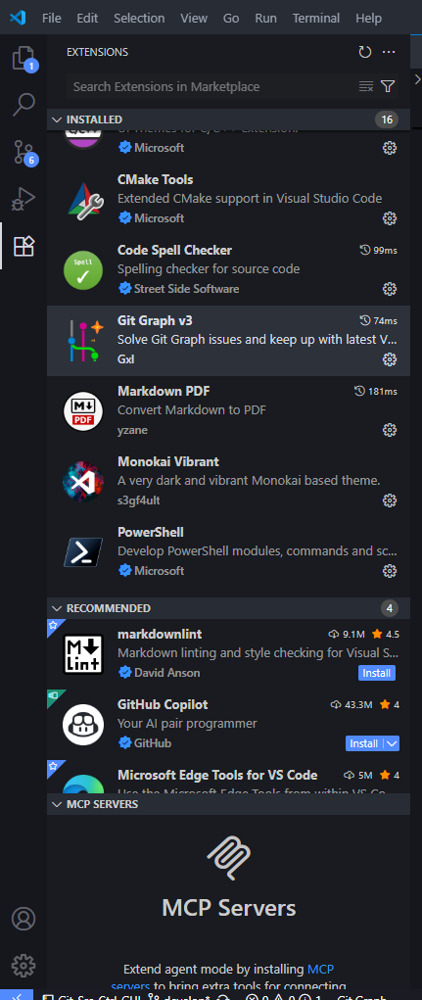

2. Search for an Extension you wish to Install

3. Click on the blue `Install` button to install

4. If you see the following pop-up, click `Trust Publisher & Install`
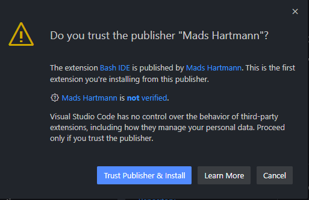

Below are some Extensions I use. These are not required, but recommended.
* **Markdown PDF** - Used to Convert markdown files to a PDF
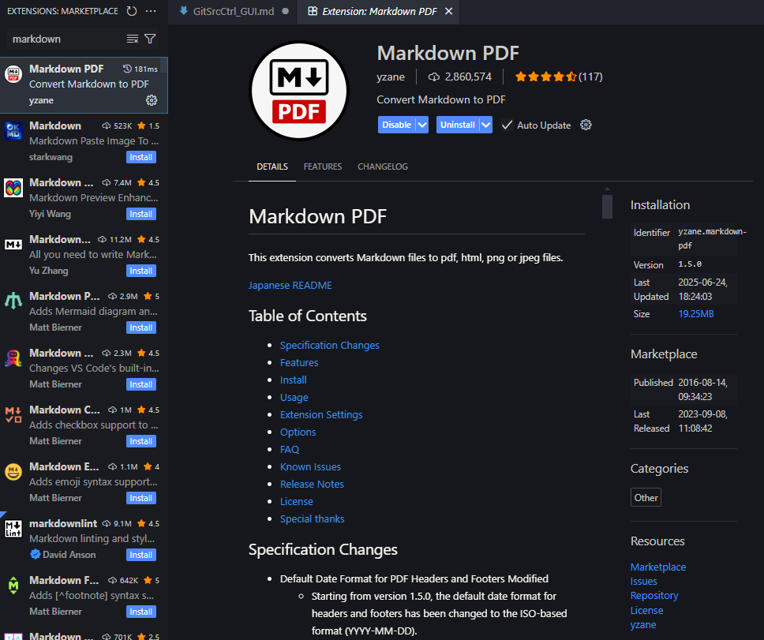

* **Git Graph v3** - Shows Git Repository History Graph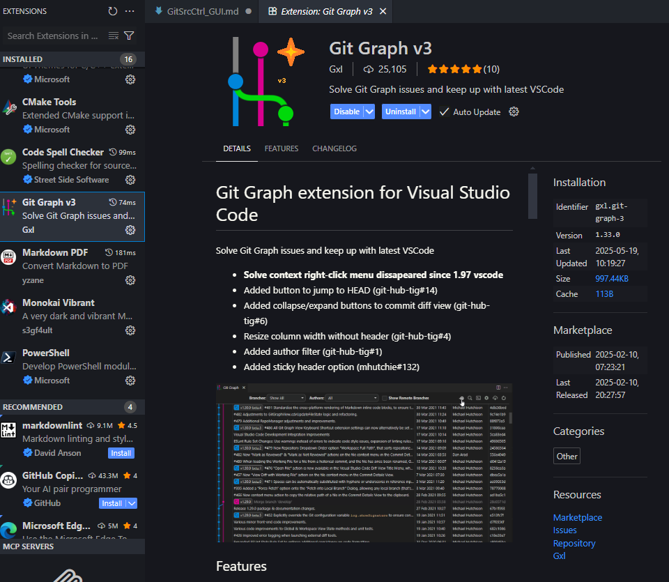

### Setup Git Source Control Within **VS Code**
We have to configure source control for **VS Code** separately from Git Bash and Git Extensions. 

1. Open **TERMINAL** by pressing `Ctrl` + `` ` `` followed by clicking `TERMINAL` on the bottom banner that opens

2. Enter the commands found in [Configure Git](#configure-git), this time into **PS** (Powershell) instead of **Git Bash**

<!-- 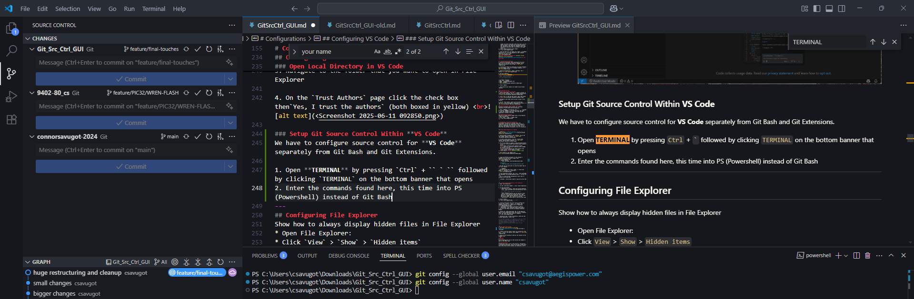 -->
---
## Configure File Explorer
Show how to always display hidden files in File Explorer
* Open File Explorer:
* Click `View` > `Show` > `Hidden items`
<br> 
---


# Introduction to GitLabs/Git Extensions
To introduce new users to **GitLabs** and **Git Extensions**, follow the steps below before trying to create or manage your own repository. I advise that you add only a few sample files to this test repo, all of which have been backed up elsewhere, just as a precaution.

### Create Project Group
1. Go to [http://gitlab01.local/dashboard/groups](http://gitlab01.local/dashboard/groups) to manage project groups

2. Click `New group`
<br> 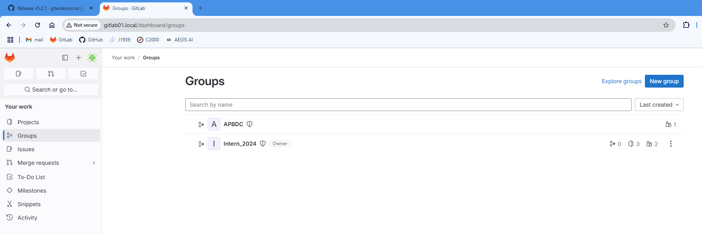

3. Click `Create group`
<br> 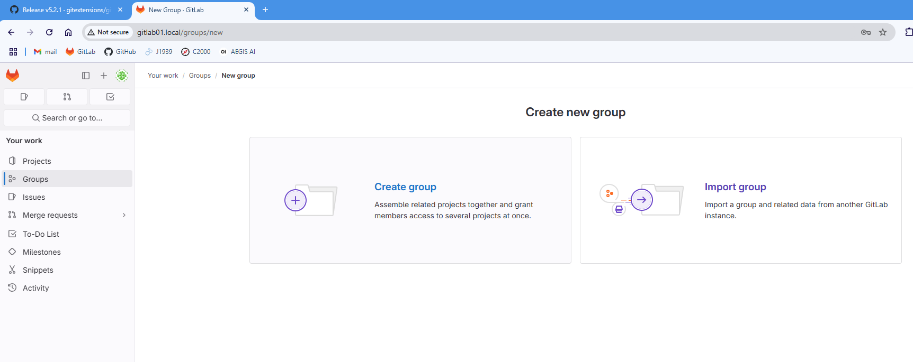

4. Add a **Group name** and ensure that **Group URL** was automatically initialized.
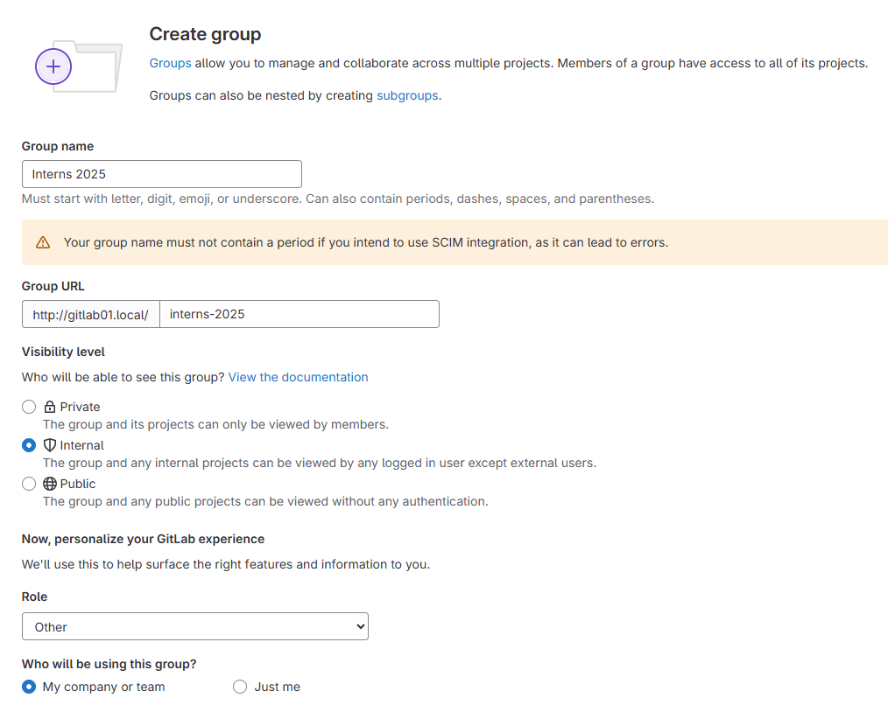

5. Set `Visibility level`. For most situations, I suggest selecting the `Internal` option allowing your co-workers to view your project, but it cannot be viewed by external members.

6. After filling out the rest of the form, Click `Create Group`

### Create Subgroup
1. Go to [http://gitlab01.local/dashboard/groups](http://gitlab01.local/dashboard/groups) to manage project groups

2. Select the group you wish to add a subgroup to and click `Create new subgroup`.
<br> 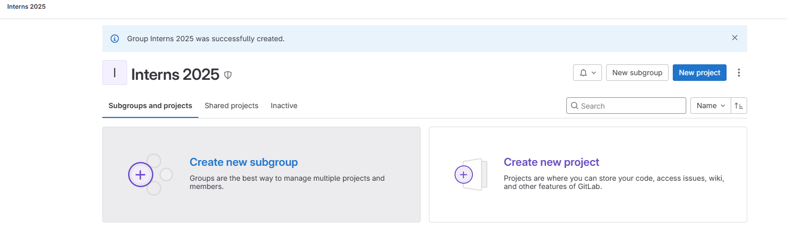

3. Input **Subgroup name** and ensure **Subgroup slug** way input automatically
<br> 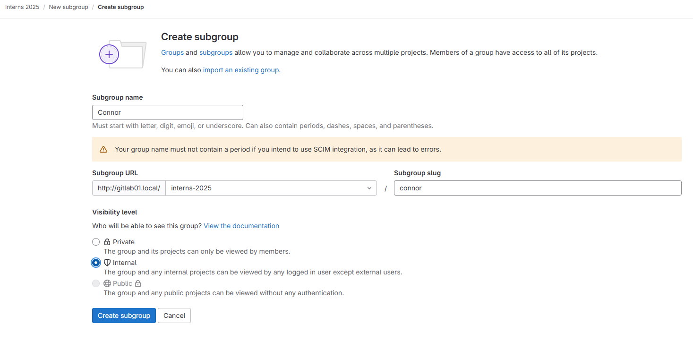

4. Set `Visibility level`. For most situations, I suggest selecting the `Internal` option allowing your co-workers to view your project, but it cannot be viewed by external members.

5. Click `Create subgroup`

### Create Remote Repository in GitLabs
> Before Creating a Remote Repository, ensure that the proper Group for the project has already been created. See [Create Project Group](#create-project-group) for more information.

1. Log in to <!-- [GitLab.iom](httpss://gitlab.com/) --> [AEGIS Gitlab Link: http://gitlab01.local/](http://gitlab01.local/) using the GitLab account you created earlier.

2. Within GitLab, navigate to the `Projects` tab on the left sidebar (boxed in yellow) <br> 

3. Click the blue `New project` button

4. To make a blank project, click the `Create blank project` button (boxed in yellow) <br> 

5. You will be taken to a page to create the blank project
   <br>a. Fill in the project name
   <br>b. Within the `Project URL`, use the drop-down to select the correct project group. 
   <br>c. Choose visibility level (boxed in green)
   <br>d. Check the `Initialize repository with a README` box (boxed in yellow)
   <br>e. To finish creating your blank project click `Create project` button (boxed in orange)
<br>

6. Your project is now ready to use


7. Copy the HTTPS URL and paste it into notepad or somewhere else you can find it again later.

<br> General Syntax:
    * `http://gitlab01.local/username/project-name`

    My Example:
    * `http://gitlab01.local/csavugot/GitSrcCtrl_GUI`

> This URL will be used later to clone the remote repo to our local computer 

> **WARNING**  
> The URL provided when using **Code** → **Clone with HTTPS** → `Copy URL` is **incorrect**.  
> 
> 
> If the copied URL contains `lan` (e.g., `http://gitlab01.lan.aegispower.com/csavugot/9402-80_cs.git`), **do NOT use it**.  
> This is a known GitLab configuration issue, and it's unlikely to be fixed soon.  
> 
> **Instead**, follow Step 7 above to copy the correct URL.

---

###  Clone Remote Repository in Git Extensions
1. Open **Git Extensions**

2. In the **left-hand sidebar**, click **Clone repository**

3. In the Clone dialog:
   - **Repository to clone**: paste your GitLab HTTPS URL  
     _(e.g., `http://gitlab01.local/username/project-name`)_ <!-- AEGIS -->
     <!-- _(e.g., `https://gitlab.com/username/project-name.git`)_ -->
     > Note, although typically you can copy the `Clone with HTTP` URL found by clicking the blue `Code` button in a remote gitlab repository, this URL does NOT work at AEGIS. We're really not sure why...
   - **Destination**: choose where to save the local copy

4. Click **Clone**
<br> <!-- AEGIS -->
<!--  -->

5. (Initial Setup Only) The first time you perform Git actions like **clone**, **pull**, or **push**, Git Credential Manager will prompt you for credentials:
<br> 
> - **Username**: your GitLab **username or email**
> - **Password**: your **Personal Access Token (PAT)**  
>  Git will save these securely via Windows Credential Manager.

6. Uncheck the `Keep dialog open` box. If the popup box doesn't close automatically after the process is complete, click 'OK' after the Clone process is complete.
<br> 

7. Dialog box says **cloned successfully, would you like to open repository?** Click `yes`.

---
### Edit Repository with VS Code
1. See [Open Local Directory in VS Code](#open-local-directory-in-vs-code) to open the repo in **VS Code**

2. Create a new file called `new.md` by clicking the `New File...` icon in the explorer left sidebar <br> 

3. Paste in the following or add your own contents to the markdown file.
```md
# New File
## Purpose
We are creating this file so that we have new changes to push to the remote repo. 

## Creation Details
Creating this file is part of the tutorial `Introduction to GitLab/Git Extensions` that will be used to teach users basic GUI actions within GitLabs, Git Extensions, and VS Code.
```

4. Save the File by pressing `Ctrl` + `s`
---
### Commit & Push to Remote Repository with VS Code
> Although you may push to remote using any method you like, this guide suggests using **Git Extensions**. See [Commit & Push to Remote Repository with Git Extensions](#commit--push-to-remote-repository-with-git-extensions) for more information.

1. Click the **Source Control** tab on the left-hand sidebar within VS Code
> You may have to click a blue `Open Repository` button, if the repository has never been opened before in VS Code.

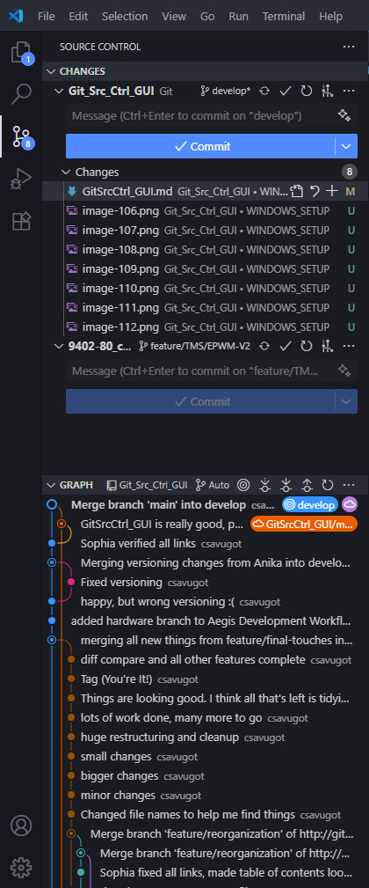

2. To ensure the small Git GRAPH in the bottom left is displaying the correct info, you must swap the graph from `Auto` to `All`. Do this by clicking `Auto` on the left-hand sidebar and using the drop-down to reconfigure to 'All'. 
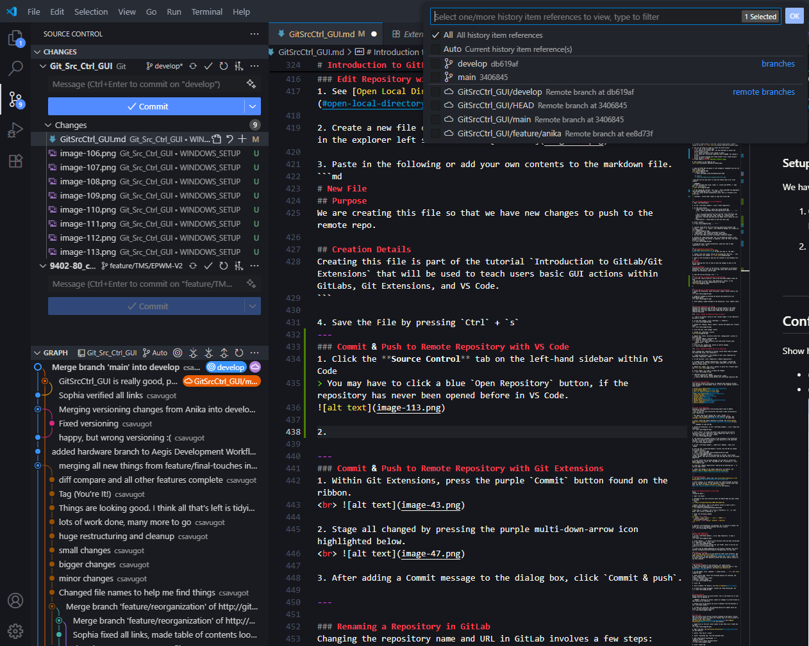

3. To View the Large Git History Graph, click **View Git Graph**
> Git Graph v3 extension must be installed for this functionality
<br>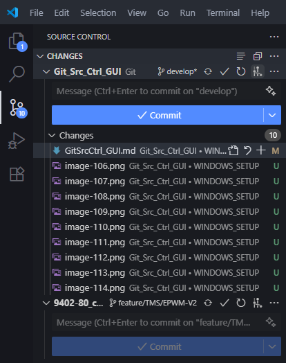

Large Git Graph:
<br>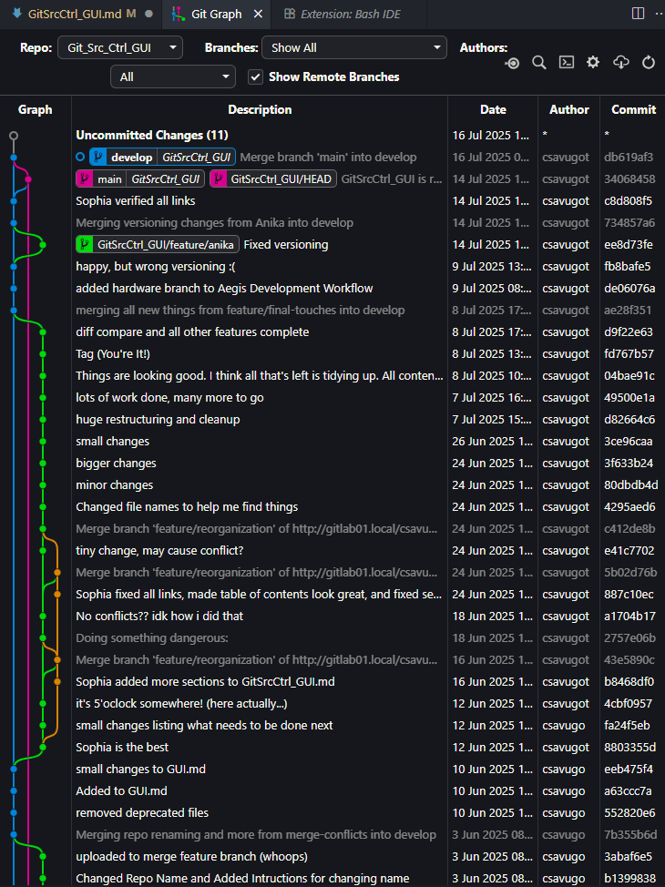

4. Click the **Stage all Changes** button and add a commit message
<br>
> Ensure all changes are shown under the `Staged Changes` section, NOT `Changes`

5. Click `Commit`

6. Click `Sync Changes` to push to Remote
<br>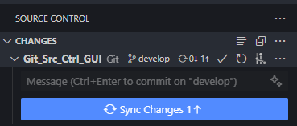

---
### Commit & Push to Remote Repository with Git Extensions
> The is the recommended way to update remote repository, but you may use other tools such as VS Code, MPLAB, etc.
1. Within Git Extensions, press the purple `Commit` button found on the ribbon.
<br> 

2. Stage all changed by pressing the purple multi-down-arrow icon highlighted below.
<br> 

3. After adding a Commit message to the dialog box, click `Commit & push`.

---

### Renaming a Repository in GitLab
Changing the repository name and URL in GitLab involves a few steps: updating the repository name in the GitLab web interface, and then updating your local Git repository’s remote URL to match. Here’s a step-by-step guide:

####  Step 1: Change the Repository Name in GitLab

1. **Log in to GitLab** and go to the **project page** of the repository you want to rename.

2. In the left sidebar, click **Settings** > **General**.
<br> 

3. Expand the **Naming, topics, avatar** section and update the **Project name**
<br> 

4. Click the blue `Save changes` button

5. Expand the **Advanced** section.


6. Update the **Path** directory within the **Change path** section to match new name
<br> **Project name:** `GitSrcCtrl GUI`
<br> **Path:** `GitSrcCtrl_GUI`
    > Note: If any space characters were used within Project name, replace with `_` here.
<br><br>
7. Click the red `Change path` button to confirm changes.
<br> 

####  Step 2: Update the Remote URL in Git Extensions

After renaming your repository in GitLab, follow these steps to update the remote URL using **Git Extensions**:

1. **Open Git Extensions** and navigate to your local repository by selecting **Repository > Open**.

2. In the top menu, click **Repository > Remote repositories**.

3. A window titled **Remote repositories** will appear, listing the current remotes. Select the correct remote repository (In most cases, there will only be one.)

4. Update the **Name** and **Url** details to match the **Project name** and  <br> 

6. Click **Save** (or **OK**) to apply the changes.
<br> 

7. (Optional) Verify the change:
   * Go to **Repository > Remote repositories** again.
   * Confirm that the URL listed matches your new GitLab repository URL.
---


# General Git GUI Commands
This section contains instructions to complete many essential actions used throughout the development cycle. A list of the commands covered is shown below:

* [Create Local Repository](#create-local-repository)
* [Clone Remote Repo](#clone-remote-repo)
* [Pull All Remote Branches to Local Repo](#pull-all-remote-branches-to-local-repo)
* [Open Local Repository](#open-local-repository)
* [Create Branch](#create-branch)
* [Checkout Branch](#checkout-branch)
* [Create Tag](#create-tag)
* [Merge Branch](#merge-branch)
* [Manage Merge Conflicts](#manage-merge-conflicts)
* [Push to Remote](#push-to-remote)
* [Delete Branch](#delete-branch)

---

## Create Local Repository
Creating a Local Repository from Existing Code & Push to Remote (First-Time Upload)
> This is only for local directories that haven't been initialized as local repositories. 
>
> This means they do not contain the **.git** folder. <br>
> **.git** may be hidden depending on file explorer settings. See [Configure File Explorer](#configure-file-explorer) for more info.

1. First, create the remote repository in GitLab. See [Create Remote Repository in GitLabs](#create-remote-repository-in-gitlabs) for more info.
    > Remember to copy the URL.

2. Within Git Extensions, on the **left-hand sidebar**, click `Create new repository`
<br> 

3. Click `Browse` to locate and select local directory you wish to initialize as a local repository. Ensure Repository type is set to `Personal repository` and click `Create`
<br> 

4. You should see a message similar to the following if Git Extensions was able to successfully initialize a new repository in the specified location. Click `OK` to continue.
<br> 

5. In the **left-hand sidebar**, right-click `Remotes`, then click `manage`

6. Fill out the **Create New Remote** section. Use the URL you copied from GitLab earlier.
* **Name:** GitSrcCtrl_GUI
* **Url:** http://gitlab01.local/csavugot/GitSrcCtrl_GUI
<br> 
> Note: The name MUST be the one specified in the URL, which cannot include spaces. This may be different than the name you see on the GitLab website UI

7. If you receive the following message, Git was able to locate your Remote Repository. Click `Yes` followed by `OK` to continue.<br> 

8. Close the **Remote repositories** pop-up box by pressing the `x` in the top right corner.

9. Commit the changes to the remote repository. For details, see [Commit & Push to Remote Repository with Git Extensions](#commit--push-to-remote-repository-with-git-extensions)

---

## Clone Remote Repo
1. For help cloning a remote repo, see [Clone Remote Repository in Git Extensions](#clone-remote-repository-in-git-extensions)

2. After cloning, it is important to pull all remote branches to ensure they're created locally, if the repository contains branches other than main. See [Pull All Remote Branches to Local Repo](#pull-all-remote-branches-to-local-repo) for more details.

---

## Pull All Remote Branches to Local Repo 
**Using Git Bash:**
> These instructions are meant to be used to initially pull new branches from remote to local. This should not be used just to fetch or pull remote changes for an initialized local branch.

1. Open **Git Bash**

2. Navigate to the local directory where the Remote Repo has been cloned. In my case:
```bash
cd /c/Users/csavugot/Downloads/APBDC-E01/apbdc-e01
```
> Within **Git Bash**, this is the general syntax to reach a User's Windows Downloads Directory <br>
> `cd /c/Users/<YourWindowsUsername>/Downloads`
>
> Note that in **windows** the C drive is denoted as `C:\`, in **git bash** the C drive is denoted as `/c/`

3. Enter the following command
```bash
git fetch --all --prune
for remote in $(git branch -r | grep -v '/HEAD'); do
  local=${remote#origin/}
  git branch --track "$local" "$remote" 2>/dev/null
done
```

4. Refresh **Git Extensions** by pressing `F5` to confirm it worked. You should soo all of the Remote Branches now exist locally
<br> 

---
## Fetch all Remotes Changes
**Using Git Extensions**
1. Click the dropdown next to `Pull - merge f8` > `Fetch all`
<br>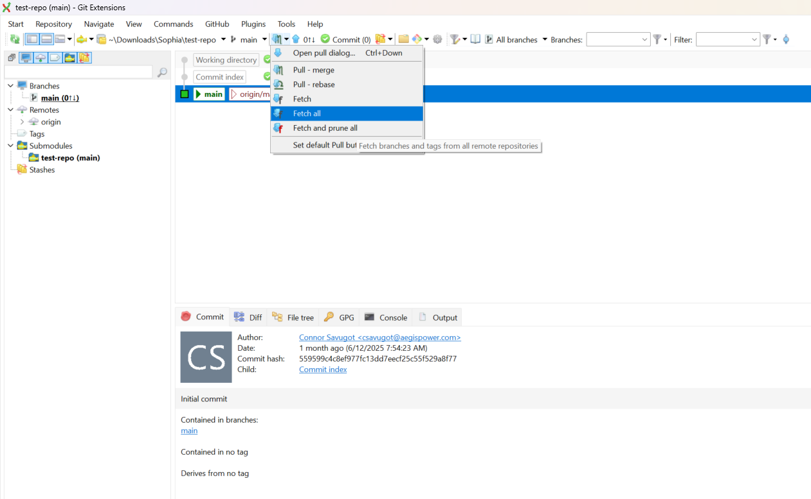

# Reset Local Changes to match Remote
> WARNING: This will delete all local changes that haven't been pushed to remote.
1. Right Click on Most Recent Commit to current branch, then click `Checkout branch...` > `<RepoName>/<branchName>`
<br>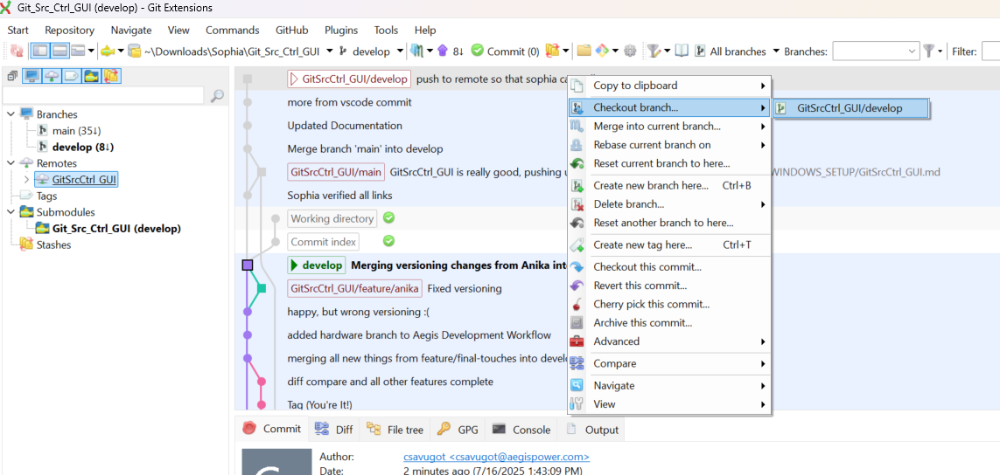
 
2. Select `Remote Branch` and `Reset local branch with the name` within options. Next, click `Checkout`
<br>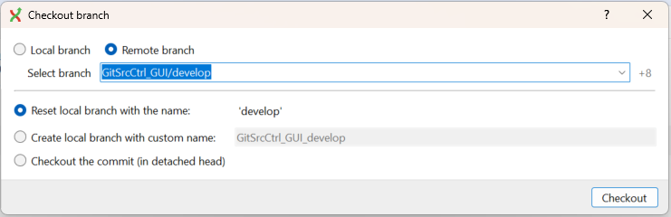

---
## Open Local Repository
### **On Git Extensions**
1. On the **left-hand sidebar**, click `Open repository` to open a repository. 
<br> 

2. Click `Browse...` to select a file directory that has been initialized as a repository. Next, click `Open`
<br> 
> The file directory must include the .git folder, which is how you can confirm it is an initialized repo. 
>
> **.git** may be hidden depending on file explorer settings. See [File Explorer Configuration](#file-explorer-configuration) for more info.

### **Open in VS Code**
1. On VS Code, just open it as you would any other local directory. See [Open Local Directory in VS Code](#open-local-directory-in-vs-code) for more information. VS Code automatically locates the **.git** folder (if it exists) and opens the repository within the source control section on the left side-bar.

---

## Create Branch
> New branch is based on local Directory, not remote branch
0. These instructions you have already have a repository open in **Git Extensions**. For more details, see [Open Local Repository](#open-local-repository)

1. On the Ribbon, Click `Commands` > `Create branch...`  <br> 

2. Enter branch name, ensure the following options are selected, and click `Create branch`
* Select `Checkout after create`
* Deselect `Create orphan`
<br> 

3. Click `OK`

4. Push to Remote. For Details, see [Push to Remote](#push-to-remote)

5. To make this prompt disappear, uncheck the `Keep dialog open` box
<br> 

---

## Checkout Branch
Branch checkout selects an active branch. This is the branch all of your changes will be applied to.

> **BEFORE** Checking out branch, commit all changes to current branch so that there are no conflicts. 

1. Double Click on the Branch you wish to Checkout from the Branches in the **left-hand sidebar**

2. If there are conflicts, the following pop-up will appear given you access to many different solutions.
<br> 

---

## Create Tag
Tags are used to mark official versions released to the public. Follow the instructions below to create one. Release Tags will only be given to commits on the `main` branch.
See [Versioning Convention](#versioning-convention) and [Tagging Convention](#tagging-convention) for more details.

1. Right-Click on the most recent commit to main then click `Create new tag here...`
<br> 

2. Add a tag name, see [Versioning Convention](#versioning-convention) for more details.

3. Select `Push tag to 'origin'`

4. Select `Annotated tag` from the drop-down menu

5. Add a Descriptive Tag Message. <br>
**General Format:**
`Release v<version> – Short Tag Description`
<br>

6. Click `Create tag`

---

## Merge Branch
1. Checkout the branch you wish to merge into (target branch). For more details, see [Checkout Branch](#checkout-branch)

2. Click `Commands` > `Merge Branches...`


3. Select the branch you wish to merge from (source branch).

4. Ensure all other selections match the screenshot below.
<br>a. Click `Always create a new merge commit`
<br>b. Select `Show advanced options`
<br>c. Select `Specify merge message`
<br>d. Enter a merge message


5. Click `Merge`

---

## Manage Merge Conflicts
### Use Git Extensions to start Merge
1. Start the merge by following the [Merge Branch instructions](#merge-branch)

2. VS Code should open immediately. If it does not, select the option to open merge conflicts in editor. 

3. Click `Resolve in Merge Editor`


4. Use the resolution buttons provided in the editor:

    - **Accept Current Change** – Keeps the version from your current branch (`HEAD`).
    - **Accept Incoming Change** – Uses the version from the branch you're merging in.
    - **Accept Both Changes** – Keeps both versions, stacked one after the other.
    - **Compare Changes** – Opens a side-by-side diff view to help you decide.

5. Click `Complete Merge`

6. Commit the merge from either **Git Extensions** or **VS Code**. For more info, see [Commit & Push to Remote Repository with Git Extensions](#commit--push-to-remote-repository-with-git-extensions)

---

## Push to Remote
1. Click `Commands` > `Push...`. 
<br> 

2. After ensuring that all information is correct, press the `Push` button.
* Ensure the both the branch selected to push from and to is `<CURRENT_BRANCH>`
<br> 

3. If more prompts appear, click `Yes` followed by `Yes` followed by `OK`.
<br> 

---

## Delete Branch
### Step 1: Deleting Local Branch
> After merging a feature branch, it's safe to delete the branch.  
> The full history, including all commits and the merge itself, is preserved in the develop branch.  
> Deleting the branch only removes the name; it does **not** erase any commit history.

> You cannot delete the branch thats currently checked-out. Checkout a different branch first. For more details, see [Checkout Branch](#checkout-branch)

1. Right Click on the Branch you wish to delete within the **left-hand sidebar**. Click `Delete Branch...`

2. Click `Delete` to confirm branch deletion 

> As mentioned, you can see from the Git Graph that although the branch was deleted, its history of existence is preserved. (Light Blue Line)
<br> 

### Step 2: Deleting Remote Branch
Note: The instructions below are for deleting a remote branch that has already been deleted locally. If you need to know how to delete a local branch, see [Delete Branch](#delete-branch)

1. Click `Commands` > `Push...`
<br> 

2. Select the `Push multiple branches` tab.
<br> 

3. Select all branches that don't exist locally.
    > Branches that don't exist locally will not have a check box under the **Push** or **Force** Column.
<br> 

4. Click `Push`


---


## Diff Compare Branches
1. Right Click on the commit or branch you wish to compare to another branch, then click `Compare` > `Compare to branch...`
<br>

2. Select the remote or local branch you wish to compare to using the buttons and dropdown menu.
<br>

3. For quick comparisons, you can you the built-in git diff tool. Otherwise, press the `Open diff using directory diff tool`
<br>

4. More in-depth comparisons can be done in **VS Code**. Open the side-by-side comparison by following the process below:
<br>a. Find the name of the first file you wish to compare.
<br>b. Right-Click the file name under the **Left** directory.
<br>c. From the context menu, select `Select for Compare`.
<br>
<br>d. Right-Click the same file name under the **Right** directory.
<br>e. From the context menu, select `Select for Compare`.
<br>

5. This gives to a visual comparison between two branches. If you wish to combine these two branches, especially selecting some , see [Merge Branch](#merge-branch). 
<br>


---

# AEGIS Development Workflow
* [Git Flow Branch Summary](#git-flow-branch-summary)
    * [Branch Naming Conventions](#branch-naming-conventions)
    * [Versioning Convention](#versioning-convention)
        * [Version Format](#version-format)
        * [Version Update Rules](#version-update-rules)
    * [Tagging Convention](#tagging-convention)
        * [Tag Examples](#tag-examples)
        * [Where Tags Fit in Git Flow](#where-tags-fit-in-git-flow)
    * [main](#main)
        * [main Branch Creation](#main-branch-creation)
        * [main Branch Management](#main-branch-management)
        * [main Branch Deletion](#main-branch-deletion)
    * [develop](#develop)
        * [develop Branch Creation](#develop-branch-creation)
        * [develop Branch Management](#develop-branch-management)
        * [develop Branch Deletion](#develop-branch-deletion)
    * [feature](#feature)
        * [feature Branch Creation](#feature-branch-creation)
        * [feature Branch Management](#feature-branch-management)
        * [feature Branch Deletion](#feature-branch-deletion)
    * [hardware](#hardware)
        * [hardware Branch Creation](#hardware-branch-creation)
        * [hardware Branch Management](#hardware-branch-management)
        * [hardware Branch Deletion](#hardware-branch-deletion)
    * [release](#release)
        * [release Branch Creation](#release-branch-creation)
        * [release Branch Management](#release-branch-management)
        * [release Branch Deletion](#release-branch-deletion)
    * [hotfix](#hotfix)
        * [hotfix Branch Creation](#hotfix-branch-creation)
        * [hotfix Branch Management](#hotfix-branch-management)
        * [hotfix Branch Deletion](#hotfix-branch-deletion)

This section lays out our development workflow. This guide makes use of **VS Code** and **Git Extensions**, minimizing command-line usage. The image below displays a general protocol that we wish to replicate here at AEGIS.


---
## Git Flow Branch Summary

| Branch               | Purpose                                | Created From            | Merges Into       | Tag? | GUI Workflow Summary                                                                                     |
| -------------------- | -------------------------------------- | ----------------------- | ----------------- | ---- | -------------------------------------------------------------------------------------------------------- |
| `main`               | Production-ready, stable code          | `release/*`, `hotfix/*` | —                 | Yes | Default branch. Use Git Extensions `Merge` with `--no-ff`. Tag via right-click (e.g., `v<version>`).     |
| `develop`            | Integrates completed features          | `main`                  | `release/*`       | No  | Create from `main`. Merge in `feature/*` or `release/*` via Git Extensions.                              |
| `feature/<name>`     | New feature or experiment              | `develop`               | `develop`         | No  | Create branch. Commit changes. Merge to `develop` with `--no-ff`. Delete after merge.                    |
| `hardware/<name>`    | Hardware-specific testing or debugging | `develop`               | Varies\*          | No  | Create from `develop`. Used for physical hardware validation and bring-up. May be deleted or rebased.   |
| `release/v<version>` | Final polish before release            | `develop`               | `main`, `develop` | Yes | Create from `develop`. Finalize changes. Merge to `main`, tag (`v<version>`), then merge to `develop`.   |
| `hotfix/v<version>`  | Urgent fix to production               | `main`                  | `main`, `develop` | Yes | Create from `main`. Apply fix. Merge to `main` and `develop`, tag, then delete.                          |

> **Tip**: Always merge with `--no-ff` to preserve history and branch identity.  
> `--no-ff` means no fast-forward.  
> By selecting `Always create a new merge commit` when completing a merge, we ensure that fast-forward is disabled.  
> See [Merge Branch](#merge-branch) for more details.

---

## Branch Naming Conventions

| Branch Type | Format Example           | Description                                                                 |
| ----------- | ------------------------ | --------------------------------------------------------------------------- |
| Feature     | `feature/<short-name>`   | Use dashes for spaces, e.g., `feature/export-csv`                           |
| Hardware    | `hardware/<short-name>`  | Used for low-level hardware testing, e.g., `hardware/spi-timing-check`      |
| Release     | `release/v<version>`     | Semantic versioning, e.g., `release/v1.2`                                 |
| Hotfix      | `hotfix/v<version>`      | Emergency patch, e.g., `hotfix/v1.3`                                      |
| Tags        | `v<version>`             | Use tags on `main` to mark official release points (e.g., `v1.0`)         |

> **Note**: `feature/*` and `hardware/*` branches should be short-lived and always branched off `develop`.

---


## Versioning Convention
To clearly track and identify production-ready releases, we use **semantic versioning** along with signed Git tags.

### Version Format

All official releases are tagged using the format:

```
v<version>
```

Where:

```
<version> = x.y
```

| Segment | Meaning            | Trigger for Change                                                                 |
| ------- | ------------------ | ---------------------------------------------------------------------------------- |
| `x`     | **Major version**  | Breaking changes, architecture changes, or other milestones that are not backward-compatible |
| `y`     | **Minor version**  | Minor changes, including crucial hot fixes, enhancements, or small feature additions |

### Version Update Rules

Every production release must be tagged with an incremented version number using the following rules:

- **Major (`x`)**: Increment when making a significant or breaking change  
  Reset `y` to `0`  
  Example: `v1.7` → `v2.0`

- **Minor (`y`)**: Increment for any changes that add value while maintaining backward compatibility  
  Includes: new features, enhancements, bug fixes, or hotfixes  
  Example: `v2.3` → `v2.4`

> This simplified scheme helps keep versioning straight forward while still conveying the **scope and impact** of each release.  
> By treating small updates (hot fixes or enhancements) the same as larger ones (within a major version), we avoid excessive micro-versioning.

---

## Tagging Convention

All tags must be **annotated and signed** to ensure traceability and security.

#### Create a new signed tag:

git tag -sa v<version> -m "Release v<version>"
git push origin v<version>

---

### Tag Examples

| Tag      | Description                                   |
| -------- | --------------------------------------------- |
| `v1.0` | First official release                        |
| `v1.1` | Adds a new feature (e.g., new module, screen) or Fixes a regression or bug |                   |
| `v2.0` | Introduces breaking changes or major refactoring  |

---

### Where Tags Fit in Git Flow

* `release/*` branches are named as `release/<version>`
* After merging a release into `main`, it is immediately tagged as `v<version>`
* Hotfixes follow the same process via `hotfix/<version>` and also result in a `v<version>` tag

Tags like `v1.0` and `v2.5` help define and trace each production milestone in your Git history.

---

## `main`
`main` is the default branch for production-ready code.

### main Branch Creation
The `main` branch is automatically created when the Git repository is initialized.  
See [Create Remote Repository](#create-remote-repository-in-gitlabs) and [Create a Local Repository](#create-local-repository) for setup details.

### main Branch Management
The `main` branch is the production-ready branch and should only be updated by merging in `release/*` or `hotfix/*` branches.  
See [Merge Branch](#merge-branch) for details.

Do **NOT** commit to `main` directly.

After a merge, apply a signed release tag to mark the official version.  
See [Versioning Convention](#versioning-convention) and [Tagging Convention](#tagging-convention) for instructions.

> The Git Flow diagram refers to this branch as `master`. We follow the modern naming convention of `main`.

### main Branch Deletion
Do not delete this branch. It serves as the primary record of all stable, production releases.

---

## `develop`
`develop` serves as the integration branch for all completed features.

### develop Branch Creation
Create the `develop` branch from `main` to act as the staging area for completed features.  
See [Create Branch](#create-branch) for detailed steps.

### develop Branch Management
All `feature/*` and `release/*` branches are merged into `develop`.  

> The first release commit does not need to be merged into develop, as it is created from develop without modification.  
> Subsequent release commits include minor bug fixes that should be merged back into develop.

See [Merge Branch](#merge-branch) and [Commit & Push to Remote Repository with Git Extensions](#commit--push-to-remote-repository-with-git-extensions) for more details.

### develop Branch Deletion
The `develop` branch is long-lived and should **NEVER** be deleted.

---

## `feature/<name>`
`feature/*` branches are used for isolated development of new features or experiments.

### feature Branch Creation
Create a new `feature/*` branch from `develop` whenever you start work on a **new feature, improvement, or experimental idea**.

Each feature gets its **own uniquely named branch** using the format:
`feature/<Short-Name>`
> Use dashes for spaces, e.g., `feature/Export-CSV`

Examples:
* `feature/Export-CSV`
* `feature/Login-Flow`
* `feature/Refactor-Header`

This keeps feature development isolated and easy to review.  
See [Create Branch](#create-branch) for detailed steps.

### feature Branch Management
Work on your feature locally, and regularly commit and push changes to the remote feature branch.  
See [Commit & Push to Remote Repository with Git Extensions](#commit--push-to-remote-repository-with-git-extensions) for detailed steps.

When complete, merge it back into `develop`.  
See [Merge Branch](#merge-branch) for more details.

### feature Branch Deletion
After merging into `develop`, the `feature/*` branch should be deleted to avoid clutter.  
Even after deletion, the branch’s history remains visible in Git logs and commit history.  
See [Delete Branch](#delete-branch) for more details.

---

Here’s a new section documenting the `hardware/*` branch pattern, written in the same tone and structure as your existing `feature/*` section. This assumes `hardware/*` branches are used to isolate code changes needed specifically for hardware validation, prototyping, or bring-up.

---

## `hardware/<name>`

`hardware/*` branches are used for development tied to **physical hardware testing**, validation, or prototyping. 

This branch type helps prevent low-level testing hacks or quick workarounds from contaminating general development (`develop` or `feature/*`).

---

### hardware Branch Creation

Create a new `hardware/*` branch from `develop` when beginning a hardware-specific investigation or test.

Each hardware branch should be clearly named based on what is being tested. Use the format:
`hardware/<Short-Name>`
> Use dashes for spaces, e.g., `hardware/ADC-test`

Examples:
* `hardware/AC-Interleaved/80kHz`
* `hardware/ADC-test`
* `hardware/DCDC-Resonant-Checks/115kHz`

See [Create Branch](#create-branch) for detailed steps.

---

### hardware Branch Management

Use these branches to:
* Try out hardware-focused experiments or debug workarounds
* Capture commit history specific to what was tested
* Share testing progress with teammates without cluttering production code

Changes made in a `hardware/*` branch may or may not be merged back into `develop`, depending on:
* Whether the test yielded a useful long-term improvement
* Whether the code is suitable for production use

> **Tip:** If a hardware branch results in a fix or enhancement that should be kept, consider **rebasing or porting those changes into a `feature/*` branch** instead of merging directly.

See [Commit & Push to Remote Repository with Git Extensions](#commit--push-to-remote-repository-with-git-extensions) and [Merge Branch](#merge-branch) for more info.

---

### hardware Branch Deletion

Once hardware testing is complete and no longer active:

* If useful changes were kept or ported, delete the `hardware/*` branch to keep your branch list clean.
* If the branch was used for short-lived debugging and won't be merged, it can also be deleted.

Even after deletion, the branch’s history remains visible in Git logs and commit history.
See [Delete Branch](#delete-branch) for more details.

---


## `release/v<version>`
`release/*` branches are used to prepare production-ready code for deployment.

### release Branch Creation
Create a new `release/*` branch from `develop` when the code is stable enough to prepare for a production release.

Each release branch is named after the version it will become, using the format:

`release/v<version>`

Examples:
* `release/v1.0`
* `release/v2.3`

You will have a **different `release/*` branch for each version** that is being finalized for deployment.

See [Create Branch](#create-branch) for instructions.  
See [Versioning Convention](#versioning-convention) for `<version>` naming guidelines.

### release Branch Management
Use the `release/*` branch to finalize everything needed before an official release — such as version numbers, documentation updates, and last-minute bug fixes.

Once finalized:

1. **Merge into `main`** — This publishes the release.  
   See [Merge Branch](#merge-branch) for detailed steps.

2. **Tag the `main` branch** with the final release version (e.g., `v1.2`).  
   See [Versioning Convention](#versioning-convention) and [Tagging Convention](#tagging-convention).

3. **Merge the same `release/*` branch back into `develop`** — This ensures that any bug fixes, doc changes, or cleanup made during the release process are carried forward into ongoing development.

> If **no changes** were made in the `release` branch after it was created from `develop`, this merge is unnecessary. However, if anything was added — even a version bump or README tweak — you **must** merge it back into `develop`.

### release Branch Deletion
Once both merges are complete and the tag is created, delete the `release/*` branch.  
Even after deletion, the branch’s history remains visible in Git logs and commit history.  
See [Delete Branch](#delete-branch) for more details.

---

# Unsorted Mess
<details>
<summary>Unsorted Mess, Click Here to view unfinished sections.</summary>

> TODO:
>
> Add Details about WHEN to Fetch or Pull from Remote
>
> For Presentation provide the following to Participants:
> > Basic Terminology
> > Git Flow Branch Summary


### Revert a Commit (Safe Undo)

**Git Extensions:**

1. View history → Right-click commit → **Revert commit**

**VS Code (with GitLens):**

1. GitLens sidebar → Locate commit → **Revert**

---

### Revert a Merge Commit

**Git Extensions:**

1. Log view → Right-click merge → Revert
2. Choose parent (usually `main`/`develop`)


### Optional: Advanced Recovery Tools

**Stash Changes**:

* Git Extensions: Toolbar → **Stash → Stash Changes**
* Apply stash when ready

**Recover Deleted Branch**:

* Git Extensions: Use **reflog** to find and restore branch points

---
### Best Practices (GUI-Compatible)

* Always push branches after creation
* Clean up merged branches
* Confirm merges with Git Graph (VS Code)
* Regularly visualize with Git Graph or Git Extensions log

---

## Fix-Specific Troubleshooting

| Problem                         | Fix                                                       |
| ------------------------------- | --------------------------------------------------------- |
| `Authentication Failed`         | Use GitLab username + token. Clear credentials if needed. |
| `Repository Not Found`          | Double-check URL and repo permissions.                    |
| `SSL Certificate Error`         | Sync system clock or reinstall Git with updated certs.    |
| `Git Not Recognized in VS Code` | Ensure Git is in your PATH. Reinstall Git if needed.      |

---

### Understanding Loose Git Objects and `git gc`

<details>
<summary>Click to expand</summary>

#### What are Loose Objects?

* Git stores commits and data as objects
* Objects can be stored as loose (individual) or packed (batched)

#### Why This Matters

Too many loose objects can degrade performance

#### What `git gc` Does

* Compresses loose objects
* Deletes unreachable refs
* Frees up disk space

#### Run the Cleanup

```bash
git gc
```

</details>

<br>

### Error: "Revision is not visible in the revision grid"

<details>
<summary>Clear all Filters, click to expand</summary>

This error means the commit exists, but Git Extensions is hiding it due to filters.

**Solution:**
<br> 
1. Clear the `Filter:` box (top right of the Git Extensions window)
2. Set `Branches:` dropdown to `All branches`
3. Click the funnel icon (🔽) on the far left → select **"Show all revisions"**
4. If needed, go to `Repository > Rescan` or restart Git Extensions

The commit should now appear in the revision graph.

</details>

</details>

---

## Resources & References
* [GitLab Docs](https://docs.gitlab.com)
* [Git Extensions Wiki](https://github.com/gitextensions/gitextensions/wiki)
* [VS Code GitLab Extension](https://marketplace.visualstudio.com/items?itemName=GitLab.gitlab-workflow)
* [Git Credential Manager](https://github.com/git-ecosystem/git-credential-manager)

---
